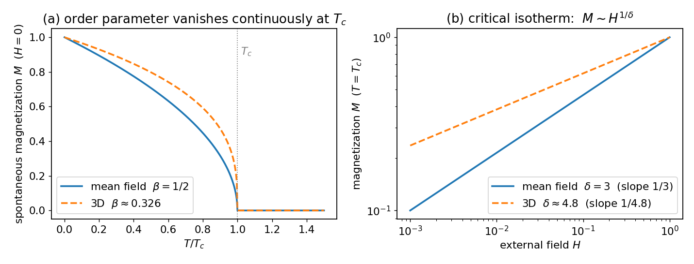

# 相变与临界指数

## 序参量与连续相变

铁磁体的总磁化 $M$（单位体积磁矩）随温度的行为：$T>T_c$ 时热运动使磁矩取向随机，无外场下 $M=0$（无序相）；$T<T_c$ 时磁矩自发同向，撤去外场仍残留 $M\neq0$（自发磁化，有序相）；分界温度 $T_c$（铁约 $1043$ K）。

凡"无序相为零、有序相非零"的量称**序参量**。相变分两类：

- **连续相变（二级）**：序参量在 $T_c$ **连续地**从零长出。临界指数只对这一类有意义。
- **一级相变**：序参量在 $T_c$ **跳变**，伴随潜热（如冰水）。本系列只讨论连续相变。

液气临界点是同类现象，序参量取液气密度差 $\rho_l-\rho_g$。

## 临界指数

约化温度 $t=(T-T_c)/T_c$。临界点附近各量按幂律奇异，幂指数即临界指数：

| 指数 | 定义 | 量 |
|---|---|---|
| $\beta$ | $\eta\sim(-t)^{\beta}$（$h=0,\ t\to0^-$） | 自发序参量 |
| $\delta$ | $\eta\sim h^{1/\delta}$（$t=0$） | 临界等温线 |
| $\gamma$ | $\chi\sim\lvert t\rvert^{-\gamma}$ | 磁化率 $\chi=\partial\eta/\partial h$ |
| $\alpha$ | $C\sim\lvert t\rvert^{-\alpha}$ | 比热 |
| $\nu$ | $\xi\sim\lvert t\rvert^{-\nu}$ | 关联长度 |
| $\tilde\eta$ | $G(r)\sim r^{-(d-2+\tilde\eta)}$（$t=0$） | 临界点关联衰减 |

关联长度 $\xi$：序参量涨落能彼此影响、步调一致的最大距离。远离 $T_c$ 时 $\xi$ 仅几个晶格间距，$T\to T_c$ 时 $\xi\to\infty$。

## 谜题

$\delta$ 测的是这样一件事：把温度精确调到 $T_c$，加一个小外场 $h$，看磁化如何随场长出来，$\eta\propto h^{1/\delta}$。这里有两套互相矛盾的答案：

| | $\beta$ | $\gamma$ | $\delta$ | $\alpha$ |
|---|---|---|---|---|
| 平均场（朗道，[[02-平均场理论算出δ等于3]]） | $1/2$ | $1$ | $\mathbf 3$ | $0$ |
| 三维伊辛（实验/数值） | $0.326$ | $1.24$ | $\mathbf{4.79}$ | $0.11$ |

"$\delta$ 是 $4.8$ 不是 $3$"即此格。对数坐标上临界等温线斜率 $1/\delta$，两者明显不同：

伊辛模型：最简单的磁体格点模型，每点一个只能朝上/朝下的自旋、相邻倾向同向；其三维数值解给出右列。

## 普适性

铁磁体、液气临界点、合金有序化等微观上毫不相干的系统，量出**同一套**临界指数，只依赖空间维度 $d$ 与序参量对称性，与原子种类、相互作用强度、晶格类型无关。平均场给出的 $\delta=3$ 与此不符；正确值 $4.8$ 从何而来、普适性又为何成立，是后面四站要解决的问题。
