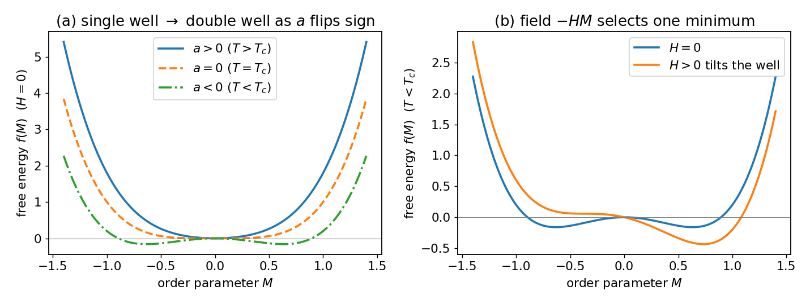

# 平均场（朗道）给出 δ=3

## 朗道自由能

平衡态取在自由能最小处。设系统空间均匀、序参量是一个常数 $\eta$。$T_c$ 附近 $\eta$ 很小，把自由能密度按 $\eta$ 展开；无外场时系统有翻转对称 $\eta\to-\eta$，只允许偶次幂，再加上与外场的耦合 $-h\eta$，保留到四次：

$$f(\eta)=f_0+a\,\eta^2+b\,\eta^4-h\eta,\qquad b>0 .$$

$b>0$ 保证自由能有下界、系统稳定。唯一的物理输入是：$a$ 在 $T_c$ 处变号，取最简单的形式 $a=a_0t$（$a_0>0$）。$a>0$ 时 $f$ 是单阱，极小点位于 $\eta=0$（无序相）；$a<0$ 时 $\eta=0$ 处变成极大，两侧各出现一个对称的极小点 $\eta\neq0$（有序相）。

平衡条件（对 $\eta$ 求极值）：

$$\frac{\partial f}{\partial\eta}=2a\eta+4b\eta^3-h=0. \tag{$\ast$}$$

## 热力学指数（α、β、γ、δ）

**$\beta$（自发磁化，$h=0$）.** 令 $h=0$，$(\ast)$ 式化为 $2a\eta+4b\eta^3=0$，解得 $\eta=0$ 或 $\eta^2=-a/2b$。$T<T_c$ 时 $a<0$，取非零解

$$\eta=\sqrt{\frac{a_0\lvert t\rvert}{2b}}\propto(-t)^{1/2}\ \Rightarrow\ \beta=\tfrac12 .$$

**$\delta$（临界等温线，$t=0$ 即 $a=0$）.** 令 $a=0$，$(\ast)$ 式化为 $4b\eta^3=h$，解得

$$\eta=\Big(\frac{h}{4b}\Big)^{1/3}\propto h^{1/3}\ \Rightarrow\ \delta=3 .$$

**$\gamma$（磁化率）.** 对 $(\ast)$ 式两边关于 $h$ 求导，记 $\chi=\partial\eta/\partial h$，得 $(2a+12b\eta^2)\chi=1$。$T>T_c$ 时 $\eta=0$，代入得 $\chi=1/(2a_0t)$；$T<T_c$ 时代入 $\eta^2=-a/2b$，有 $2a+12b\eta^2=-4a$，得 $\chi=1/(4a_0\lvert t\rvert)$。两侧都给出 $\gamma=1$。

比热由 $f$ 在极小处对 $t$ 求二阶导得到，结果是一个有限跳变，故 $\alpha=0$。以上四个是均匀朗道理论能给出的热力学指数；关联指数 $\nu=\tfrac12,\ \tilde\eta=0$ 必须由涨落分析才能得到（[[关联函数与关联长度]]）。六个平均场指数的汇总见 [[03-平均场为何失败]]。

## 外场何时保留、何时设零

$(\ast)$ 式里带有 $h$。求**自发/内禀**量（$\beta$ 对应的自发磁化，以及后面的关联函数）时设 $h=0$；求**对外场的响应**（$\delta$、$\chi$）时则保留 $h$。其机理：把序参量场绕平衡值 $\eta$ 展开，涨落 $\delta\varphi$ 的线性项系数恰好等于平衡条件 $(\ast)$ 的左端，按 $(\ast)$ 它为零，所以 $h$ 只平移均值 $\eta$、不进入涨落的二次型——内禀量与 $h$ 无关。

## 隐藏假设

整个推导都假设序参量空间均匀、自由能是它的光滑函数，相当于把每个磁矩感受到的邻居作用换成统一的平均场，**抹掉了空间涨落**。而 $T_c$ 处 $\xi\to\infty$，涨落跨越所有尺度，恰恰就是被抹掉的那部分。下一站把这一点定量化，给出平均场失效的判据。
