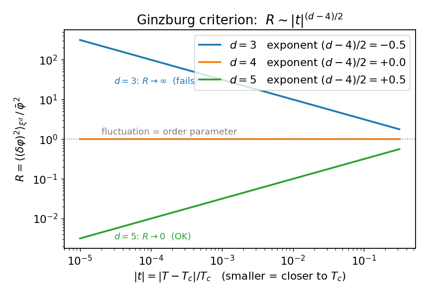

# 平均场为何失败

平均场把序参量当成均匀的，抹掉了涨落（[[02-平均场理论算出δ等于3]]）。本站定量给出它失效的判据。

## 平均场的六个临界指数

| 指数 | 值 | 来源 |
|---|---|---|
| $\alpha$（比热） | $0$（跳变） | 朗道 $f$ 极小对 $t$ 二阶导（[[02-平均场理论算出δ等于3]]） |
| $\beta$（自发磁化） | $1/2$ | 同上 |
| $\gamma$（磁化率） | $1$ | 同上 |
| $\delta$（临界等温线） | $3$ | 同上 |
| $\nu$（关联长度） | $1/2$ | 高斯涨落 $\xi=\sqrt{c/a}\propto\lvert t\rvert^{-1/2}$（[[关联函数与关联长度]]） |
| $\tilde\eta$（关联衰减） | $0$ | 高斯涨落 $G\sim r^{-(d-2)}$（同上） |

前四个（热力学指数）来自空间均匀的朗道自由能极小化；后两个（关联指数）必须把序参量当成场、做高斯涨落分析才能得到——均匀朗道理论本身给不出 $\nu,\tilde\eta$。

这六个值满足三条不含 $d$ 的标度律：Rushbrooke $\alpha+2\beta+\gamma=0+1+1=2$；Widom $\beta(\delta-1)=\tfrac12\cdot2=1=\gamma$；Fisher $\nu(2-\tilde\eta)=\tfrac12\cdot2=1=\gamma$。但超标度律 $\nu d=2-\alpha$ 代入后成了 $d/2=2$，只在 $d=4$ 时成立——这预示了下面金兹堡判据里维度 $4$ 将是分界。

## 自洽判据（金兹堡判据）

平均场可信的条件是：它所忽略的涨落确实足够小。具体地，在**关联体积** $\xi^d$ 内（$\xi$ 范围内的涨落步调一致、真正起作用），涨落要远小于序参量本体：

$$\langle\Phi_V^2\rangle\ \ll\ \eta^2,\qquad \Phi_V=\frac1V\int_V\delta\varphi\,d^dr\ (V=\xi^d).$$

这里 $\langle\Phi_V^2\rangle$ 是序参量在体积 $V$ 上**空间平均之后**的方差，而不是发散的逐点方差 $\langle\delta\varphi(\mathbf r)^2\rangle$。

## 关联体积内的涨落

$$\langle\Phi_V^2\rangle=\frac1{V^2}\int_V\!\!\int_V\langle\delta\varphi(\mathbf r)\delta\varphi(\mathbf r')\rangle\,d^dr\,d^dr'=\frac1{V^2}\int_V\!\!\int_V G(\mathbf r-\mathbf r')\,d^dr\,d^dr'.$$

固定两点间距、先对其中一个变量积分，得到的重叠体积 $\approx V$，于是双重积分 $\approx V\!\int G$，从而 $\langle\Phi_V^2\rangle\approx\dfrac1V\int G=\dfrac{k_BT\chi}{V}$（末步用了 [[涨落-响应关系]] 中的 $\int G=k_BT\chi$）。代入 $V=\xi^d\propto\lvert t\rvert^{-d/2}$、$\chi\propto\lvert t\rvert^{-1}$：

$$\langle\Phi_V^2\rangle\propto\frac{\lvert t\rvert^{-1}}{\lvert t\rvert^{-d/2}}=\lvert t\rvert^{(d-2)/2}.$$

## 比值与上临界维度

序参量本体（[[02-平均场理论算出δ等于3]]，$T<T_c$）为 $\eta^2=\dfrac{a_0\lvert t\rvert}{2b}\propto\lvert t\rvert$。把判据两边相除：

$$R(t)=\frac{\langle\Phi_V^2\rangle}{\eta^2}\propto\frac{\lvert t\rvert^{(d-2)/2}}{\lvert t\rvert}=\lvert t\rvert^{(d-4)/2}.$$

| 维度 | $(d-4)/2$ | $t\to0$ 时 $R$ | 平均场 |
|---|---|---|---|
| $d>4$ | $>0$ | $\to0$ | 可信 |
| $d=4$ | $0$ | 常数 | 临界维度 |
| $d<4$ | $<0$ | $\to\infty$ | 失效 |

上临界维度 $d_c=4$。

## 结论

真实世界 $d=3<4$：越靠近 $T_c$，涨落越压倒序参量，平均场系统性地出错——这正是 $\delta\neq3$ 的根本原因。反过来，$d>4$（如五维）时平均场反而精确，$\delta=3$ 在那里确实成立。平均场对不对，取决于空间维度。

但判据只告诉我们"$d<4$ 时失效"，并没有给出正确的 $\delta$ 值。它点明了 $d=4$ 这个特殊维度，以及"偏离 $4$ 的程度 $4-d$"才是关键变量——第五站的重整化群正是以 $\varepsilon=4-d$ 为小量做展开。在那之前，第四站先用标度假设把待求的指数压缩到最少。
