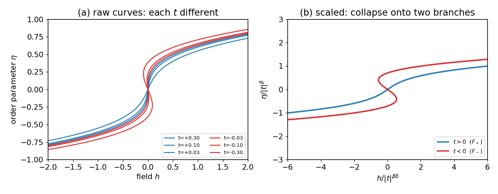

# 标度假设与普适性

## 奇异自由能

自由能密度分成解析的背景部分与非解析部分：$f(t,h)=f_{\rm reg}+f_s$。临界发散全部来自 $f_s$（$C=-\partial_t^2 f$ 里，只有 $-\partial_t^2 f_s\sim\lvert t\rvert^{-\alpha}$ 是发散的）。

$f_s$ 的非解析性来自**对序参量取极小**这一步，而非朗道展开本身。朗道自由能 $f(\eta)=a_0t\,\eta^2+b\eta^4$ 作为 $\eta$ 的函数是光滑的，但真正的热力学自由能是对 $\eta$ 取极小的结果 $f_{\rm phys}(t)=\min_\eta f$。分两种情况：$t>0$ 时极小点在 $\eta=0$，极小值为 $0$；$t<0$ 时极小点在 $\eta^2=-a_0t/2b$，代回得极小值 $-\dfrac{a_0^2}{4b}t^2$。两段并起来就是

$$f_s(t)=-\frac{a_0^2}{4b}\,t^2\,\theta(-t),$$

它在 $t=0$ 处非解析（二阶导跳变，故 $C$ 跳台阶，$\alpha=0$）。可对比 $\min(0,t)$：它在原点处有一个折点。对一族光滑函数逐点取极小（取下包络），正是这样在它们交接的地方造出非解析。

## 标度假设

$$\boxed{\ f_s(t,h)=\ell^{-d}\,f_s(\ell^{\,y_t}t,\ \ell^{\,y_h}h)\qquad\forall\,\ell\ge1.\ }$$

它的来源（卡丹诺夫块自旋）：临界点处 $\xi=\infty$，系统没有特征长度，因而自相似。把格点分成边长 $\ell$ 的方块、每块用一个块自旋代表，得到的还是同一个模型，只是参数按幂律重新标定 $t'=\ell^{y_t}t,\ h'=\ell^{y_h}h$；自由能是广延量，一个块自旋顶替 $\ell^d$ 个原自旋，故密度被摊薄 $\ell^{-d}$ 倍。这种自相似的函数就是广义齐次函数（[[广义齐次函数]]，对应 $x\to t,\,y\to h$；因 $t,h$ 两个变量权重不同，故称"广义"）。

## 导出指数

取 $\ell=\lvert t\rvert^{-1/y_t}$，把第一个变量标度成 $\pm1$，得 $f_s(t,h)=\lvert t\rvert^{d/y_t}\Phi_\pm\!\big(h/\lvert t\rvert^{y_h/y_t}\big)$。再用 $\eta=-\partial_h f_s$、$\chi=-\partial_h^2 f_s$、$C\sim-\partial_t^2 f_s$：

$$\alpha=2-\tfrac d{y_t},\quad \beta=\tfrac{d-y_h}{y_t},\quad \gamma=\tfrac{2y_h-d}{y_t},\quad \delta=\tfrac{y_h}{d-y_h}.$$

（求 $\delta$ 时令 $t=0$，改取 $\ell=h^{-1/y_h}$，得 $f_s(0,h)\sim h^{d/y_h}$。）关联性质方面：由 $\xi=\ell\,\xi(\ell^{y_t}t)$ 得 $\nu=1/y_t$，由场的重标度得 $\tilde\eta=d+2-2y_h$。六个指数全部由 $(y_t,y_h,d)$ 表出，其中**独立的只有两个**。

## 标度律

把上面的表达式代回，即可验证它们都是恒等式：

$$\alpha+2\beta+\gamma=2,\quad \gamma=\beta(\delta-1),\quad \gamma=\nu(2-\tilde\eta),\quad \nu d=2-\alpha.$$

所以只需测准其中两个独立指数，其余的全部确定。

## 超标度与 $d=4$

$\nu d=2-\alpha$ 显式含 $d$。它的物理来源是 $f_s\sim\xi^{-d}$（每个关联体积 $\xi^d$ 贡献 $O(k_BT)$，即"一个关联体积一个自由度"），再结合 $f_s\sim\lvert t\rvert^{2-\alpha}$ 即可得到。平均场下 $\nu=\tfrac12,\alpha=0$，于是 $\nu d=d/2$ 而 $2-\alpha=2$，二者只在 $d=4$ 时相等——从标度的角度重新得到了上临界维度。那三条不含 $d$ 的标度律平均场都满足，唯独超标度律卡在 $d=4$（$d>4$ 时它被危险无关变量破坏，见 [[05-重整化群]]）。

## 数据塌缩

由 $\eta=-\partial_h f_s$ 得到状态方程的标度形式（其中 $\beta=(d-y_h)/y_t$，$\beta\delta=y_h/y_t$）：

$$\frac{\eta(t,h)}{\lvert t\rvert^{\beta}}=\mathcal F_\pm\!\Big(\frac{h}{\lvert t\rvert^{\beta\delta}}\Big).$$

把不同 $t$ 的 $(\eta,h)$ 按上式重标度后，所有点落到两条曲线 $\mathcal F_\pm$ 上（按 $t\gtrless0$ 分支）。两个极限自洽：取自变量 $u\to0$，$\mathcal F_-(0)\neq0$ 重现自发磁化 $\eta\sim(-t)^\beta$；取大自变量 $u\to\infty$，$\mathcal F_\pm(u)\sim u^{1/\delta}$ 重现临界等温线 $\eta\sim h^{1/\delta}$（此时 $t$ 恰好消去）。可见临界等温线只是塌缩曲线在大自变量端的切片，所以 $\delta$ 虽然定义在 $t=0$ 处，检验数据塌缩却要用到多个不同的 $t$。关联函数同理：$G(r,t)=r^{-(d-2+\tilde\eta)}\Psi(r/\xi)$。可分析的数据见 [[数据集-CrBr3标度]]。

## 普适性

指数只依赖空间维度 $d$ 与序参量的分量数 $n$（伊辛 $n{=}1$、XY $n{=}2$、海森堡 $n{=}3$），与微观细节无关：

| 普适类 | $\beta$ | $\gamma$ | $\delta$ | $\nu$ |
|---|---|---|---|---|
| 平均场 $d\ge4$ | $1/2$ | $1$ | $3$ | $1/2$ |
| 2D 伊辛 | $1/8$ | $7/4$ | $15$ | $1$ |
| 3D 伊辛 | $0.326$ | $1.24$ | $4.79$ | $0.63$ |
| 3D XY | $0.35$ | $1.32$ | $4.78$ | $0.67$ |
| 3D 海森堡 | $0.37$ | $1.40$ | $4.78$ | $0.71$ |

标度假设与普适性在这里仍然只是经验拟设。第五站将从重整化群把二者导出，并算出 $(y_t,y_h)$。
