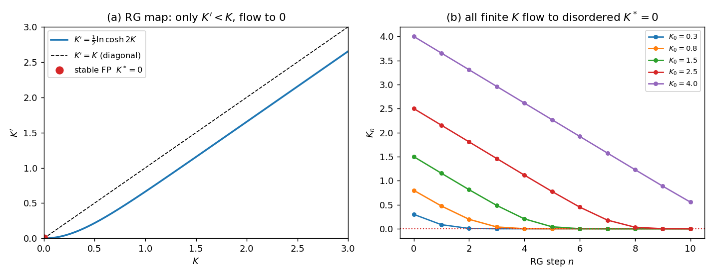

# 一维伊辛抽取 RG（精确算例）

## 模型与变换

一维伊辛链 $-\beta E=K\sum_i s_is_{i+1}$，$K=J/k_BT$。抽掉奇数格点：$s_i$ 只耦合两邻居，对它求和

$$\sum_{s_i=\pm1}e^{K s_i(s_{i-1}+s_{i+1})}=2\cosh\!\big(K(s_{i-1}+s_{i+1})\big)\overset{!}{=}A\,e^{K's_{i-1}s_{i+1}}.$$

$s_{i\pm1}$ 同号（和 $\pm2$）：$2\cosh2K=A e^{K'}$；异号（和 $0$）：$2=A e^{-K'}$。相除：

$$\boxed{\ K'=\tfrac12\ln\cosh 2K.\ }$$

格距翻倍（$b=2$）的精确 RG 映射。

## 不动点与流

$K'=K$ 解：$K^*=0$；$K^*=\infty$。大 $K$ 时 $K'\approx K-\tfrac12\ln2<K$；且对任意有限的 $K$，由 $\cosh2K<\tfrac12 e^{2K}$ 可得 $K'<K$。故迭代把任意有限 $K$ 都推向 $0$：

- $K^*=0$（$T=\infty$）稳定，吸引一切有限 $K$；
- $K^*=\infty$（$T=0$）不稳定。

## 结论

无有限 $K$ 的不动点 $\Rightarrow$ 无 $\xi=\infty$ 的临界点（除 $T=0$）：一维伊辛在 $T>0$ 不发生有序相变（$d=1$ 是伊辛的下临界维度）。关联长度由 $\xi(K)=2\xi(K')$ 定，近 $K^*=\infty$ 处 $\xi\sim e^{2K}=e^{2J/k_BT}$，仅 $T\to0$ 发散。

二维及以上会出现一个**有限** $K^*$ 的不稳定不动点，那才是临界点；在它附近线性化给出临界指数（[[05-重整化群]]）。
