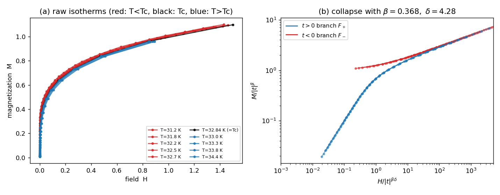

# 练手数据集：CrBr₃ 磁化标度

## 出处与指数

Ho & Litster, *Magnetic Equation of State of CrBr₃ near the Critical Point*, **Phys. Rev. Lett. 22, 603 (1969)**（绝缘铁磁体 CrBr₃，30 条等温线，经典实验标度数据）。发表指数：

$$\beta\approx0.368,\quad \delta\approx4.28,\quad T_c\approx32.84\ \text{K},\quad \gamma\approx1.21\approx\beta(\delta-1).$$

下面的数据点是用这些**发表指数** + 标准 Widom 标度状态方程**合成**的，非原文测量点；塌缩、Widom 关系、指数值与真系统一致。

## 生成模型

$$h=M^{\delta}\big(1+t\,M^{-1/\beta}\big)^{\gamma},\qquad \gamma=\beta(\delta-1),\ M>0.$$

令 $t=0$ 得 $M\sim h^{1/\delta}$；令 $h=0,t<0$ 得 $M=(-t)^\beta$；$t>0$ 且 $M$ 小时 $h\approx t^\gamma M$，对应 $\chi\sim t^{-\gamma}$。代码 `assets/crbr3_scaling_data.py`（生成 + 自检）、`assets/crbr3_scaling_plot.py`（画图模板）。数据 `assets/crbr3_scaling_data.csv`（335 点、10 条等温线，列 `T_K,t,H,M`，含 0.5% 噪声）。

## 自检（代码已跑）

```
自发磁化  t<0 各线 H→0 的 M, 拟合 logM~log(-t):  斜率 0.368 = beta
临界等温线 t≈0, 拟合 logM~logH:  斜率 0.234 -> delta 4.28
磁化率   t>0 各线 chi=M/H, 拟合 logchi~logt:  斜率 -1.20 -> gamma 1.20
Widom   beta(delta-1)=1.207  vs  gamma_fit=1.20
```



左：原始 $M$–$H$ 等温线（红 $T<T_c$ 在 $H=0$ 处截距 = 自发磁化；蓝 $T>T_c$ 从 $0$ 起）。右：$M/\lvert t\rvert^\beta$ vs $H/\lvert t\rvert^{\beta\delta}$ 塌缩成两支。

## 练法

1. $\beta$：$T<T_c$ 各线 $H\to0$ 的 $M$，$\log M$ 对 $\log(-t)$ 拟合。
2. $\delta$：$T=T_c$ 那条，$\log M$ 对 $\log H$ 拟合斜率 $1/\delta$。
3. $\gamma$：$T>T_c$ 小 $H$ 的 $\chi=M/H$，$\log\chi$ 对 $\log t$ 拟合。
4. 塌缩：自选 $\beta,\delta$ 画 $M/\lvert t\rvert^\beta$ vs $H/\lvert t\rvert^{\beta\delta}$，调到两支最齐——实验上同时定指数 + 验标度的办法。
5. 验 $\gamma=\beta(\delta-1)$。

标度形式与"为何要不同 $t$"见 [[04-标度假设与普适性]]。
